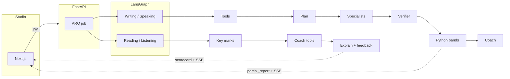

# Northband

A full-skill IELTS practice studio, and a production-shaped multi-agent scoring system.

Listening and Reading are marked from answer keys. Writing and Speaking are analysed by specialist models — then Python owns the band, and invented quotes never reach the student.

Python 3.12 · FastAPI · LangGraph · Next.js 15 · PostgreSQL · Redis · MIT

> Practice estimates only. Not official IELTS scores. Independent of the British Council, IDP, and Cambridge.

## Overview

Northband is a timed studio for Listening, Reading, Writing, and Speaking (Academic and General Training), plus a four-skill mock. It is also a reference implementation of how to run LLMs in a product without treating them as a chatbot: compiled graphs, JSON-schema contracts, deterministic tools, a quote verifier, and exam-condition ceilings.

| Skill | What the student sits | How it is scored |
|-------|------------------------|------------------|
| Listening | Shared Academic / GT · section audio | Key marks /40 · band only on a full paper |
| Reading | Academic + GT · MCQ, TFNG, completion, short answer | Key marks |
| Writing | Academic + GT · Task 1 and Task 2 | Four criteria via specialist agents |
| Speaking | Parts 1–3 or a full interview · audio or transcript | Four criteria |
| Full mock | Blueprint session | Writing = Task 1×⅓ + Task 2×⅔ · four-skill mean |

Short Reading/Listening drills report accuracy only. They are not converted to a paper band and do not move the progress estimate.

Sit a paper → report (bands or marks, grammar, plan) → drill the weakest criterion → optional span rewrite (~+0.5) → re-sit the same prompt and see the criterion delta.

## Design

A single “score this essay” prompt tends to invent quotes, ignore word count, and drift from the rubric. Northband splits ownership so models cannot quietly become the examiner.

| Layer | Owns | Must not own |
|-------|------|----------------|
| Deterministic tools | Word count, coverage, fillers, WPM | Bands |
| Specialist LLMs | Criterion analysis + verbatim evidence | Final band |
| Verifier | Drop quotes that are not in the source; cap inflated grammar | — |
| Exam rules | Under-length, missing overview, short speaking | — |
| Scoring math | Clamp 0–9, half-band, mean of four criteria | — |
| Coach agents | Study drills, next focus, wrong-item tips | Scores |
| Reading / Listening keys | Marks out of 40 | Never an LLM |
| Paper bank | Next unused or generated writing/speaking paper | Reading/Listening keys |

## AI agents

There is no chat agent. An evaluation is a compiled LangGraph. The student never sees the models; they see a report that appears in stages.

Two graphs share one LLM router (JSON schema in, Pydantic out, retries, call logs):

1. **`evaluation_graph`** — Writing and Speaking: rubric specialists, verifier, Python bands.
2. **`objective_graph`** — Reading and Listening: keys first, then a tool-using coach loop.

Revision and paper generation are one-shot calls off the graph.



### Roster

| Agent | Contract | Role |
|-------|----------|------|
| Writing | `WritingAgentOutput` | Task Response / Achievement, Coherence, Lexical, Grammar — proposed bands and evidence quotes |
| Speaking | `SpeakingAgentOutput` | Fluency, Lexical, Grammar, Pronunciation (proxy if text-only) |
| Grammar | `GrammarAgentOutput` | Issue spans, recurring patterns, vocabulary upgrades |
| Scoring | `BandScoreOutput` | Optional notes only — cannot change bands (off by default) |
| Feedback | `FeedbackAgentOutput` | Strengths, weaknesses, 3–5 timed study actions |
| Performance | `PerformanceAgentOutput` | Criterion trends, plateau, a single next focus |
| Revision | `RevisionAgentOutput` | +0.5-band rewrite of one span |
| Explain | explain batch JSON | Reading/Listening wrong-item coaching after keys |
| Coach | `CoachStepOutput` | Tool loop: list misses → inspect → quote context → note |
| Bank | generated paper JSON | Original writing/speaking papers for one user — never used for keys |

Each agent can be pinned with `AGENT_*` (`provider:model`). Unset keys use `LLM_DEFAULT_*`. Grammar, performance, and explain can use `LLM_CHEAP_MODEL`.

| Piece | May propose | Owns |
|-------|-------------|------|
| Writing / speaking | Criterion bands | Evidence quotes, summaries |
| Grammar | Issue list | Patterns, vocab upgrades |
| Coach / explain | Miss tips | Not marks |
| Verifier | — | Quote drop, grammar cap |
| Scoring math | — | Final bands and overall |
| Scoring LLM | Notes, confidence | Not bands |
| Feedback | Study actions | Not scores |
| Performance | Next focus | Not scores |
| Revision | Rewritten span | Not scores |
| Bank | Original papers | Not Reading/Listening keys |

Writing/Speaking: **tools → plan → specialists (parallel) → verify → Python bands → coach**. The planner skips unused calls (tiny answers skip grammar; thin history skips performance; identical input reuses a cache).

Reading/Listening: **keys → coach tool loop (max 8 steps) → leftover explain batch → feedback**. Marks are never LLM-judged.

Without an API key, agents return heuristic mock JSON so the UI and tests still run.

Node-by-node detail is in [docs/AGENT_ARCHITECTURE.md](docs/AGENT_ARCHITECTURE.md). Contracts and how to add an agent: [docs/AGENTS.md](docs/AGENTS.md).

## Engineering

What a hiring manager can inspect in the repo:

- **Orchestration, not a mega-prompt** — compiled `StateGraph`s, cost-aware `plan` node, parallel `asyncio.gather`, 360s worker timeout, 45s per LLM call
- **Structured output as a contract** — every agent returns validated Pydantic; invalid JSON is retried; schema is sent to the provider and echoed in the system prompt
- **Grounding** — evidence quotes must be a substring of the candidate text or they are dropped; quote hit rate is shown on the report; the Reading/Listening coach must quote context before it writes a tip
- **Separation of concerns** — LLMs propose; `scoring/bands.py` and `exam_rules.py` decide; scoring LLM is off by default
- **Objective vs generative** — Reading/Listening keys in `scoring/objective.py`; explain/coach run after marks exist; drills under 35 marks are not converted to a band
- **Cost-aware routing** — skip unused specialists, reuse cached analysis, cheaper model for grammar / performance / explain
- **Offline eval without keys** — `python -m app.eval.offline` checks schema validity and quote-hit-rate on a gold set
- **Memory that is not a transcript dump** — `coach_profile` keeps weak patterns, last focus, and criterion EWMA (α = 0.4)
- **Provider routing** — OpenRouter, Gemini, OpenAI-compatible, or mock JSON
- **Production shape** — JWT and rate limits, ARQ/Redis jobs, SSE stage events, LLM call logs as an agent trace, Docker Compose, Alembic

## Stack

| Layer | Choice |
|-------|--------|
| Studio | Next.js 15 (App Router), React 19, Recharts |
| API | FastAPI, SQLAlchemy async, Pydantic v2 |
| Agents | LangGraph `StateGraph` (writing/speaking + objective), JSON-schema LLM calls |
| Jobs | Redis + ARQ (in-process fallback in development only) |
| Data | PostgreSQL 16 |
| Models | OpenRouter, Gemini, or any OpenAI-compatible host; mock when keys are missing |
| Speech | Local faster-whisper (CPU) for speaking; Pocket TTS for listening |

```
.
├── apps/api/               FastAPI, LangGraph, ARQ worker, Alembic, pytest
│   ├── app/                Agents, LLM router, scoring, content bank, routers, DB
│   ├── tests/              Contract tests (no live LLM keys)
│   └── alembic/            Optional migrations (001–004)
├── apps/web/               Next.js 15 studio (App Router)
├── docs/                   Architecture, agents, setup, deploy, API
├── packages/shared/        How Pydantic and TypeScript contracts stay aligned
├── scripts/                dev.sh / dev.ps1 / seed helpers
├── docker-compose.yml      Postgres, Redis, API, worker, web
├── docker-compose.prod.yml VPS / production-ish (no bind mounts)
└── .env.example            Runtime settings
```

## Quick start

```bash
cp .env.example .env
docker compose up --build
```

Studio: [http://localhost:3000](http://localhost:3000) · API: [http://localhost:8000/docs](http://localhost:8000/docs)

Startup seeds the demo user and the curated item bank. To refresh:

```bash
./scripts/seed.sh
```

Login: `demo@northband.app` / `demo12345`

An LLM key is optional. Without one, agents use mock JSON so you can walk the UI.

```bash
cd apps/api && pytest
python -m app.eval.offline
```

Same path on macOS, Windows (Docker Desktop), and Ubuntu. Helpers: `./scripts/dev.sh` or `.\scripts\dev.ps1`. First API build downloads torch (CPU only). OS notes and VPS deploy: [docs/DEPLOY.md](docs/DEPLOY.md). Environment variables: [docs/SETUP.md](docs/SETUP.md).

## Documentation

| Document | Contents |
|----------|----------|
| [docs/AGENT_ARCHITECTURE.md](docs/AGENT_ARCHITECTURE.md) | Both graphs, specialists, scoring, memory, coach tools |
| [docs/AGENTS.md](docs/AGENTS.md) | Contracts, tools, how to add an agent |
| [docs/ARCHITECTURE.md](docs/ARCHITECTURE.md) | Request flow, data model, studio routes, security |
| [docs/API.md](docs/API.md) | REST, auth, jobs, events |
| [docs/SETUP.md](docs/SETUP.md) | Docker vs local, environment variables, tests |
| [docs/DEPLOY.md](docs/DEPLOY.md) | macOS / Windows / Ubuntu, host mode, VPS Compose |

## Practice loop

Coach memory (`users.coach_profile`) stores weak patterns, last focus, and an EWMA of criterion bands so later attempts do not repeat the same advice.

Writing and Speaking papers come from a shuffled prompt bank. After a few sits, a live LLM may inject an original paper for that account only. Reading and Listening keys stay curated — they are never generated.

---

MIT License. IELTS is a trademark of the British Council, IDP: IELTS Australia and Cambridge University Press & Assessment.
