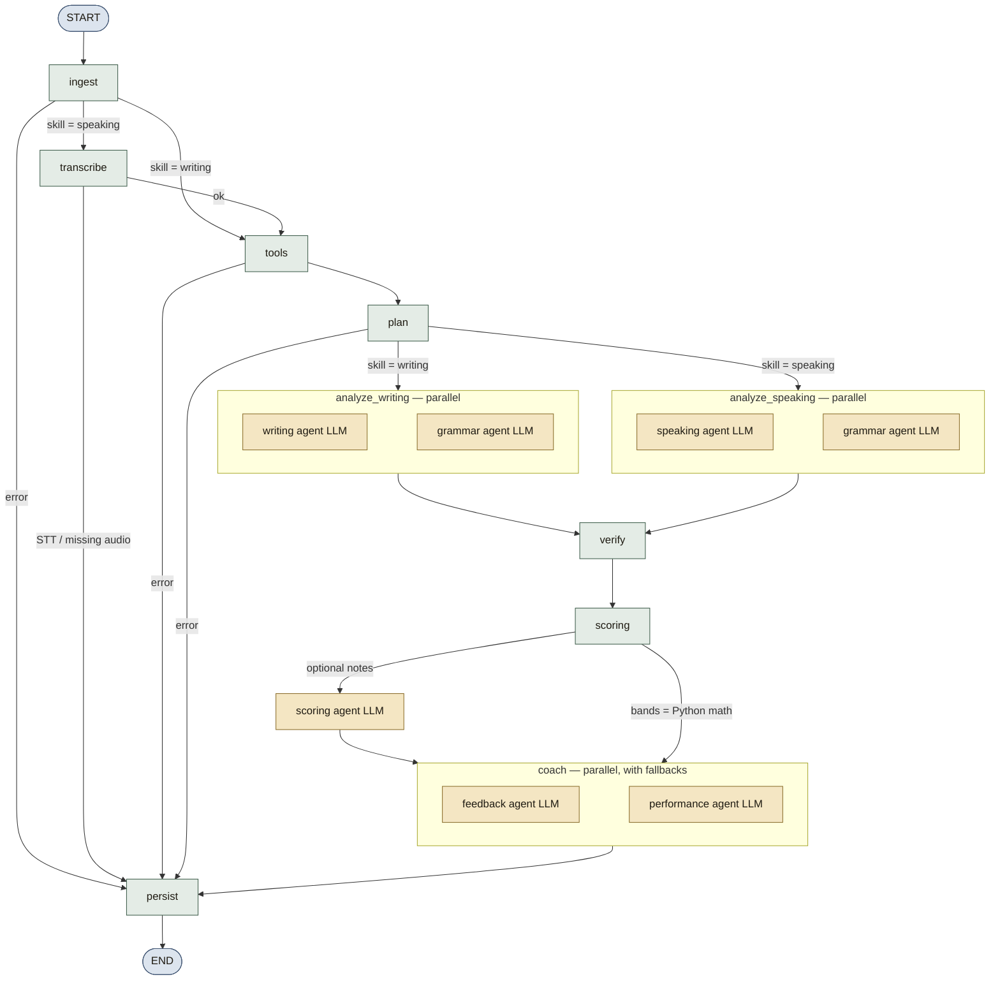

# Agents

How the pipeline works, end to end: [AGENT_ARCHITECTURE.md](AGENT_ARCHITECTURE.md).

Northband’s evaluation is two compiled LangGraphs of **JSON-only** specialist agents plus deterministic tools and a verifier. Models never receive a free-form chat transcript. Every agent returns validated Pydantic. Invalid JSON is retried; schema failure after retries surfaces as a job error or a coach fallback.

| Piece | Location |
|-------|----------|
| Contracts | `apps/api/app/schemas/agents.py` |
| Prompts + rubric injection | `apps/api/app/agents/prompts.py`, `rubrics.py` |
| Writing/Speaking graph | `apps/api/app/agents/graph.py` |
| Reading/Listening graph | `apps/api/app/agents/objective_graph.py`, `objective_flow.py` |
| Coach tools (objective) | `apps/api/app/agents/coach_tools.py` |
| Planner + analysis cache | `apps/api/app/agents/planner.py`, `analysis_cache.py` |
| Tools | `apps/api/app/agents/tools.py` |
| Quote + grammar verify | `apps/api/app/agents/verify.py` |
| Exam ceilings | `apps/api/app/agents/exam_rules.py` |
| Coach memory | `apps/api/app/agents/memory.py` |
| Paper bank | `apps/api/app/content/prompt_bank.py`, `assign.py`, `generate.py` |
| Router | `apps/api/app/llm/router.py` |
| Frontend report type | `apps/web/src/lib/types.ts` |

## Design rules

1. **JSON schema in, JSON out.** `llm_router.complete_json` asks the provider for the Pydantic JSON schema and repeats the contract in the system prompt.
2. **Quotes must be copied from the candidate text.** The verifier drops invented spans. Grammar issues whose `span` is not in the source are dropped in the grammar node before verify. The objective coach must `quote_context` before `note_explanation`.
3. **Tools are facts.** Word count, under-length, Task 1 coverage, fillers, and duration/WPM must not be contradicted by the specialist.
4. **Bands are deterministic.** Specialists propose; `scoring/bands.py` clamps and half-rounds. The scoring LLM (off by default) may only write notes and confidence. Objective marks come from keys, never an LLM.
5. **Exam ceilings.** `exam_rules.apply_exam_ceilings` hard-caps Task/Fluency for under-length, missing Academic overview, weak GT letter coverage, short Part 2 / full interview, very slow speaking, and uncovered cue-card points.
6. **Coach failures are non-fatal.** Feedback, performance, and the objective coach loop have heuristic fallbacks so a timeout still yields a study list.
7. **Objective marks are never LLM-judged.** Reading/Listening use keys; explain/coach only coach traps after scoring. Drills under 35 marks are not converted to a band.
8. **Skip unused LLM calls.** The `plan` node is deterministic. Cache identical specialist input. Do not add agents that only repeat tools.
9. **Never generate keys.** `AGENT_BANK` may invent writing/speaking papers for one user. Reading/Listening stay curated.

## Current agents

| Agent | Env key | Schema | Role |
|-------|---------|--------|------|
| Writing | `AGENT_WRITING` | `WritingAgentOutput` | Task Response / Achievement, Coherence, Lexical, Grammar — each with `proposed_band`, summary, evidence quotes |
| Speaking | `AGENT_SPEAKING` | `SpeakingAgentOutput` | Fluency, Lexical, Grammar, Pronunciation (proxy if text-only); mode, WPM, duration |
| Grammar / vocab | `AGENT_GRAMMAR` | `GrammarAgentOutput` | Issues (`span`, type, correction, explanation, optional CEFR), recurring patterns, vocabulary upgrades |
| Band score | `AGENT_SCORING` | `BandScoreOutput` | Optional notes only; does not own bands |
| Feedback | `AGENT_FEEDBACK` | `FeedbackAgentOutput` | Strengths, weaknesses, 3–5 `StudyAction`s (`drill_prompt`, `drill_task`), examiner summary |
| Performance | `AGENT_PERFORMANCE` | `PerformanceAgentOutput` | Criterion trends, plateau, single `next_focus`, comparison note |
| Revision | `AGENT_REVISION` | `RevisionAgentOutput` | +0.5-band rewrite of one span; listed concrete changes |
| Explain | `AGENT_EXPLAIN` | explain batch JSON | Reading/Listening leftover misses after the coach loop (`EXPLAIN_LLM_ENABLED`) |
| Coach | `AGENT_COACH` | `CoachStepOutput` | Tool loop over wrong items: `list_misses`, `inspect_item`, `quote_context`, `note_explanation`, `finish` |
| Bank | `AGENT_BANK` | generated paper JSON | Original writing/speaking papers (`content/generate.py`). Never used for keys. |

Env values are `provider:model`, for example `openrouter:openai/gpt-4o-mini`. Unset keys use `LLM_DEFAULT_PROVIDER` / `LLM_DEFAULT_MODEL`. Grammar, performance, and explain use `LLM_CHEAP_PROVIDER` / `LLM_CHEAP_MODEL` when those are set and `AGENT_*` is empty. Coach and bank use the default model unless overridden.

`skill_focus` on study actions should be one of: `task_response`, `coherence`, `lexical`, `grammar`, `fluency`, `pronunciation`, `vocabulary` (objective drills may use question skill tags such as `accuracy`).

## Writing / Speaking LangGraph

The compiled graph is `evaluation_graph` in `apps/api/app/agents/graph.py`. It is a `StateGraph(EvaluationState)`: every node receives the shared state dict, returns patches, and LangGraph merges them. The ARQ worker runs `evaluation_graph.ainvoke(initial)`.

Solid arrows are fixed edges. Dashed arrows are `add_conditional_edges` (`_after_ingest`, `_after_transcribe`, `_after_tools`, `_after_plan`). Nodes with an LLM badge call `llm_router.complete_json`. `analyze_*` and `coach` fan out with `asyncio.gather` *inside* the node — LangGraph still sees one node. The `plan` node is deterministic: it skips unused specialists and may reuse a cached analysis.



| Graph node | Kind | Writes on state |
|------------|------|-----------------|
| `ingest` | DB | `history`, `coach_profile`, `target_band`, `parent_attempt` |
| `transcribe` | STT | `transcript`, `audio_meta`, `speaking_mode` |
| `tools` | Python | `tools` (word count, coverage, fillers, …) |
| `plan` | Python | `plan`, `cached_analysis`, `agent_trace` — skip unused LLM calls |
| `analyze_writing` | 0–2 LLMs | `writing_analysis`, `grammar_analysis` (cache or skip grammar) |
| `analyze_speaking` | 0–2 LLMs | `speaking_analysis`, `grammar_analysis` (cache or skip grammar) |
| `verify` | Python | quote-filtered analysis + grammar band cap |
| `scoring` | Python (+ optional LLM) | `band_scores`, `delta`, `examiner_first_impression` |
| `coach` | 2 LLMs, fallbacks | `feedback`, `performance`, `warnings` |
| `persist` | DB | attempt, scores, study plan, `coach_profile`; job `completed` / `failed` |

Routing helpers (return the **next node name**):

| Function | After | Next |
|----------|-------|------|
| `_after_ingest` | `ingest` | `transcribe` if speaking, else `tools`; `persist` on error |
| `_after_transcribe` | `transcribe` | `tools`; `persist` on error |
| `_after_tools` | `tools` | `plan`; `persist` on error |
| `_after_plan` | `plan` | `analyze_speaking` or `analyze_writing`; `persist` on error |

Revision is **not** on this graph. `run_revision` is a one-shot LLM call from `POST /evaluations/{id}/revise`.

`ingest` injects last-12-attempt history and `profile_for_prompt(coach_profile)` into later prompts.

`analyze_*` runs the skill specialist and the grammar agent in parallel. Grammar issues are filtered to spans that actually appear in the essay or transcript.

`verify`:

- `quote_in_source` — normalized substring match; quotes shorter than 4 characters are rejected; longer quotes may match on the first 24 characters
- `reconcile_grammar_band` — issue count caps an inflated grammar proposal (12+ → 5.0, 8+ → 5.5, 5+ → 6.0, 3+ → 6.5)

`scoring` half-bands the four criteria, applies exam ceilings, then averages. Text-only speaking lowers confidence and annotates pronunciation as a proxy. Under-length, dropped quotes, and ceilings also lower confidence. If `parent_attempt` is present, `report.delta` is attached here.

`coach` runs feedback and performance together. Fallbacks pick the lowest criterion, reuse the attempt prompt as a drill, and rotate `next_focus` if it matches `last_next_focus`.

`persist` writes the attempt JSONB report (including `bank_item_id` when the sit came from the prompt bank), normalized `criterion_scores`, drill-ready `study_plan_items`, and `update_coach_profile` (weak patterns, EWMA α = 0.4, attempt count).

## Reading / Listening LangGraph

`objective_graph` in `apps/api/app/agents/objective_graph.py`. Keys run first. The LLM never decides marks.

```
START → ingest → grade → coach_loop → synthesize → persist → END
```

| Node | Kind | Role |
|------|------|------|
| `ingest` | DB | Load published set, questions, keys, passage/transcript context |
| `grade` | Python | `grade_attempt`; band only if `max_marks >= 35` |
| `coach_loop` | `AGENT_COACH` + tools | Up to 8 steps; `CoachStepOutput.action` is one of the tools below |
| `synthesize` | `AGENT_EXPLAIN` + feedback/performance | Fill leftover notes; write study list |
| `persist` | DB | Attempt, optional band, study items; drills have `is_drill: true` |

Coach tools (`coach_tools.py`): `list_misses`, `inspect_item`, `quote_context`, `note_explanation`, `finish`. Trace lands on `report.objective.coach_trace`.

## Deterministic tools (writing / speaking)

`analyze_text` always runs before the LLMs:

| Signal | When |
|--------|------|
| Word / sentence / paragraph counts, average sentence length | Always |
| Expected min words 150 / 250, `under_length` | Writing Task 1 / Task 2 |
| Linker list and count | Always |
| Overview markers (or GT letter purpose/tone) | Writing Task 1 |
| Bullet / letter-clause coverage vs prompt | Writing Task 1; Speaking Part 2 / full |
| Filler count (`um`, `like`, `you know`, …) | Speaking |
| Duration, WPM, `pronunciation_is_proxy` | Speaking (from STT / audio meta) |

These values are serialized into specialist prompts as “treat as facts”.

## Memory passed to models

Slim profile only:

```json
{
  "weak_patterns": ["article omission", "..."],
  "last_next_focus": "coherence",
  "criterion_ewma": { "Task Response": 6.2 },
  "attempt_count": 4
}
```

Feedback is instructed not to repeat `last_next_focus` verbatim unless it is still the bottleneck.

## Mock provider

With no API keys, `llm/router.py` uses `llm/mock_responses.py` so tests and local UI work. Mock JSON still validates against the same Pydantic models. Pytest lives in `apps/api/tests/`:

- `test_graph.py` — writing/speaking graph compiles
- `test_objective_graph.py` — objective graph compiles; coach tools + mock coach contract
- `test_bands.py` — half-band math
- `test_schemas.py` — mock payloads match Pydantic (including `CoachStepOutput`)
- `test_agentic_loop.py` — quote verify, grammar caps, tools, gold essays
- `test_exam_rules.py` — under-length, overview, Part 2 / full-interview ceilings
- `test_memory.py` — coach-profile EWMA
- `test_objective.py` — Reading/Listening keys and content validators
- `test_planner.py` — cost-aware skip rules, analysis cache, cheap-model routing
- `test_offline_eval.py` — schema validity + quote-hit-rate on the gold set
- `test_assign.py` / `test_prompt_bank.py` — exam-before-drill, user shuffle, curated bank
- `test_stt.py` / `test_tts_script.py` — Whisper model names; listening script parse

## Adding an agent

1. Add a Pydantic model in `schemas/agents.py`.
2. Add a system/user prompt in `prompts.py` (and rubric text in `rubrics.py` if it scores a criterion).
3. Implement a node that calls `llm_router.complete_json(...)` (or `_complete` in `graph.py`). For objective coaching, prefer a tool in `coach_tools.py` plus one `CoachStepOutput` action rather than a new free-form agent.
4. Register the node in `build_graph()` or `build_objective_graph()` and connect edges. Prefer parallel `asyncio.gather` when the node does not depend on another LLM.
5. Optionally add `AGENT_MYAGENT=provider:model` in `.env` and map it in `AGENT_ENV` inside `llm/router.py`.
6. Merge the output into `_partial` / `persist_node` (or `persist_objective_result`) so it lands on `attempts.report`.
7. Render new fields on `apps/web/src/app/app/results/[id]/page.tsx` and extend `apps/web/src/lib/types.ts`.
8. Add a contract test under `apps/api/tests/` (`test_schemas.py`, `test_agentic_loop.py`, `test_objective_graph.py`, or a new file). Add a mock branch in `llm/mock_responses.py`.

Do not send free-form chat to the model. Always validate JSON and retry on schema failure. Quotes must appear in the candidate response (or passage/transcript for the objective coach). Do not let a new scoring agent overwrite deterministic half-bands unless you intentionally change `scoring_node`. Do not let a new agent mark Reading/Listening items.
