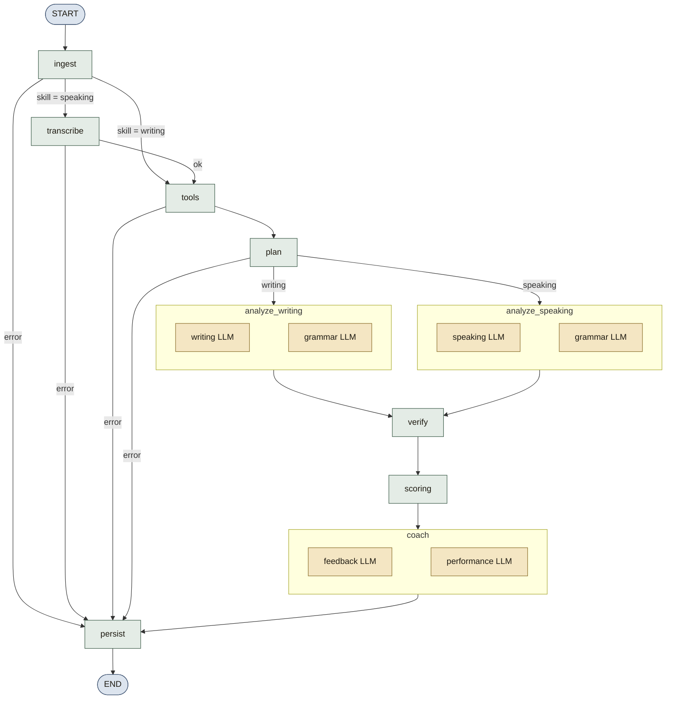
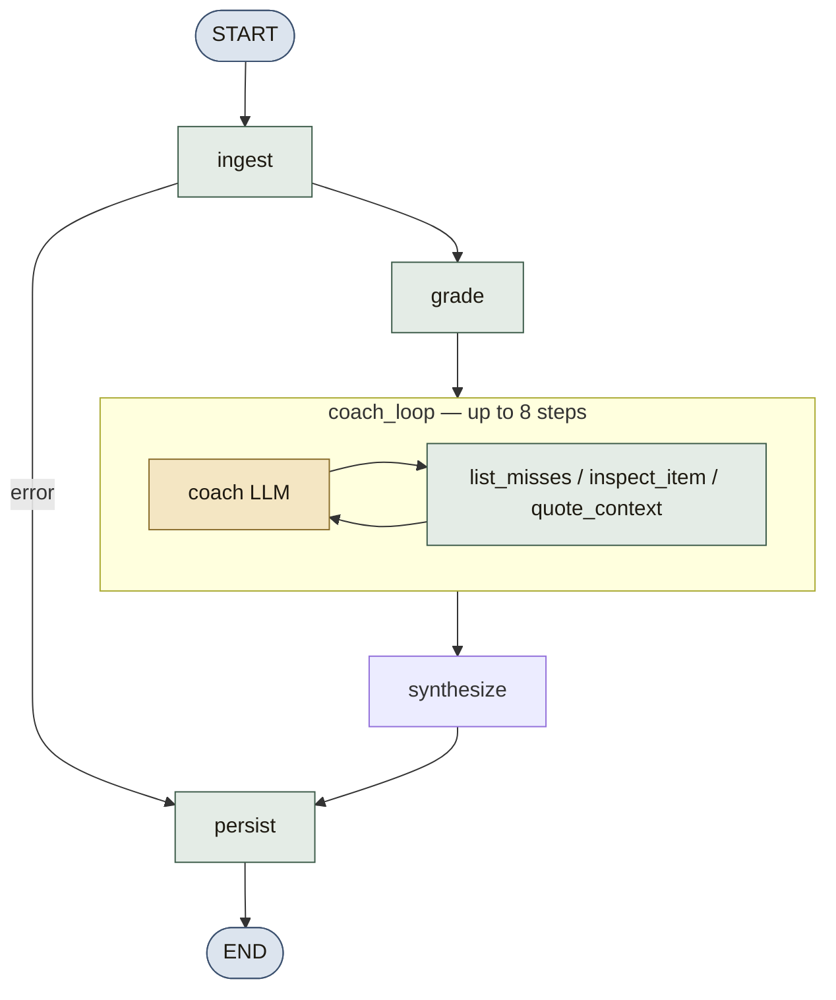

# Agent architecture

Northband is not a chatbot. There is no single “IELTS agent” that you talk to. An evaluation is a **compiled LangGraph** of specialist models, deterministic tools, and a verifier. The graph runs as a background job. The student never sees the models; they see a report that appears in stages.

This document explains that system: what runs, in what order, what each agent is allowed to decide, and how a band number is produced.

Related: [AGENTS.md](AGENTS.md) (contracts and how to add an agent), [ARCHITECTURE.md](ARCHITECTURE.md) (API, data, UI), [API.md](API.md) (HTTP).

## What “the agent” is

| Layer | Responsibility |
|-------|----------------|
| LangGraph (`evaluation_graph`) | Writing/Speaking pipeline with conditional edges. Owns *when* work happens. |
| LangGraph (`objective_graph`) | Reading/Listening: keys first, then a tool-using coach loop. |
| Specialist LLMs | Propose criterion analysis, grammar issues, coach notes. Never own the final band or objective marks. |
| Deterministic tools | Word count, coverage, fillers, duration. Treated as facts. |
| Coach tools | `list_misses`, `inspect_item`, `quote_context` — grounded investigation of wrong items. |
| Verifier | Drops invented quotes; caps an inflated grammar band. |
| Scoring math | Clamp 0–9, round to 0.5, average four criteria. Objective papers use raw/40 tables. |
| Coach memory | Weak patterns + criterion EWMA injected into later prompts. |
| LLM router | Picks provider/model per agent, forces JSON schema, retries, logs calls. |
| Paper bank | Next unused writing/speaking paper; optional generated original (`AGENT_BANK`). Never generates Reading/Listening keys. |

Entry point: `run_evaluation_job(job_id)` in `apps/api/app/agents/graph.py`. The ARQ worker calls that function.

- For `skill in {reading, listening}` the job runs **`objective_graph`** via `run_objective_evaluation` (`objective_flow.py` → `objective_graph.py`).
- Writing/Speaking use `evaluation_graph = build_graph()`.

Revision (`POST /evaluations/{id}/revise`) is a **separate** one-shot LLM call (`run_revision`). It is not a graph node. Paper generation (`content/generate.py`, agent `bank`) is also off-graph.

## Objective skills (Reading / Listening)

| Rule | Detail |
|------|--------|
| Correctness | Never LLM. `scoring/objective.py` matches keys + acceptable variants. |
| Band | `raw_to_band` tables (`listening_v1`, `reading_academic_v1`, `reading_general_v1`). Only if `max_marks >= 35` (`is_full_paper`). Short **drills** stay accuracy-only (`is_drill: true`, `overall_band` null) and are excluded from progress estimates. |
| AI | `objective_graph` coach loop (max 8 steps) investigates misses with tools, then leftover items get a cached explain batch. Feedback/performance LLMs synthesise a study list. |
| Listening audio | HTML5 playback; Pocket TTS (or macOS `say`) synthesises section audio. Whisper is **Speaking-only**. Transcripts unlock after submit. |
| Authoring | Curated seed packs (`seed_content.py`). Next unused set prefers exam papers over drills, shuffled per user. Keys are never generated. |

## Why this shape

A single prompt that “score this IELTS essay” tends to invent quotes, ignore word count, and drift from official criteria. Northband splits the job so that:

1. **Facts are not negotiated.** Tools run first. Specialists are told not to contradict them.
2. **Evidence is checkable.** Every quote must appear in the student’s text or it is dropped.
3. **Bands are math.** Models propose; Python half-rounds and averages. Objective marks come from keys.
4. **Grammar is cross-checked.** A dedicated grammar agent lists issues; verify can lower the specialist’s grammar band if the issue count is high.
5. **Coaching can fail without failing the job.** Feedback and performance have heuristic fallbacks.
6. **Wrong-item tips are grounded.** The Reading/Listening coach is instructed to `quote_context` before `note_explanation`.

## Writing / Speaking graph

### State

Every node reads and returns `EvaluationState` (`TypedDict` in `graph.py`). Important fields:

```
job_id, user_id, skill, module, task, prompt
essay_text | transcript | audio_path | speaking_mode
audio_meta          duration, WPM
tools               deterministic analysis
writing_analysis | speaking_analysis
grammar_analysis
band_scores
feedback, performance
history             last 12 attempts (criterion bands)
coach_profile
parent_attempt, delta
target_band
warnings, error
plan, cached_analysis, agent_trace
```

Nodes copy the dict and add keys. If `error` is set, later analysis nodes no-op and `persist` marks the job `failed`.

Partial reports published to the UI are built by `_partial(state)`: tools, writing/speaking, grammar, scores, feedback, performance, delta, warnings, `agent_trace`, plus the practice-estimate disclaimer.

### LangGraph architecture

`build_graph()` constructs a `StateGraph(EvaluationState)`, registers ten nodes (including the cost-aware `plan` router), then `compile()`s it to `evaluation_graph`. The worker calls `ainvoke` with the job payload. LangGraph merges each node’s returned dict into state.



Wiring in code (`graph.py`):

```
add_edge(START, ingest)
conditional ingest  → transcribe | tools | persist     # _after_ingest
conditional transcribe → tools | persist               # _after_transcribe
conditional tools   → plan | persist                   # _after_tools
conditional plan    → analyze_writing | analyze_speaking | persist  # _after_plan
add_edge(analyze_writing, verify)
add_edge(analyze_speaking, verify)
add_edge(verify, scoring)
add_edge(scoring, coach)
add_edge(coach, persist)
add_edge(persist, END)
```

Parallel LLM calls (`asyncio.gather`) happen **inside** `analyze_writing`, `analyze_speaking`, and `coach`. They are not separate LangGraph nodes, so a specialist timeout still returns one merged state blob for that step.

Each node calls `patch_job_progress`. That writes `evaluation_jobs.stage` / `partial_report` and publishes Redis `northband:job:{id}` so the studio can poll or subscribe via SSE.

Typical wall clock: several LLM calls (writing+grammar in parallel unless the planner skipped or cached them, then optionally scoring notes, then feedback and maybe performance), each capped by `LLM_TIMEOUT_SECONDS` (default 45). The worker job timeout is 360 seconds.

Revision is off-graph: `run_revision` from `POST /evaluations/{id}/revise`.

### Node by node

#### 1. Ingest (no LLM)

Marks the job `running`. Loads:

- the student’s `target_band` and `coach_profile`
- the last **12** attempts with per-criterion scores (oldest last, for trend prompts)
- the parent attempt if `parent_attempt_id` is set (for a later delta)

History and a slim profile (`profile_for_prompt`) are what later agents see as “memory”. The full profile is not dumped into the prompt.

#### 2. Transcribe (speaking only)

If a transcript is already in the payload, it is used. Otherwise `services/stt.py` transcribes `audio_path`. Default order (`STT_PROVIDER=auto`): **local faster-whisper** (CPU int8), then cloud Whisper / Gemini if a key is set. Duration comes from WAV headers or mutagen; words-per-minute is `word_count / duration * 60`. ffmpeg resamples non-WAV uploads to 16 kHz mono before Whisper.

Text-only speaking sets `speaking_mode=text` and later `pronunciation_is_proxy=true`. There is no acoustic pronunciation model.

Speaking `task` may be `part1`, `part2`, `part3`, or `full` (interview).

#### 3. Tools (no LLM)

`analyze_text` in `apps/api/app/agents/tools.py` produces facts the models must not contradict:

| Signal | Used for |
|--------|----------|
| Word / sentence / paragraph counts | Length, fluency proxy |
| Expected min 150 (Task 1) / 250 (Task 2), `under_length` | Task Achievement / Response |
| Discourse linkers found | Coherence |
| Overview markers (or GT letter purpose/tone markers) | Academic Task 1 / GT letter |
| Bullet / letter-clause coverage vs prompt | Task 1 completeness; Speaking Part 2 cue card |
| Filler count (`um`, `like`, `you know`, …) | Speaking fluency |
| Duration, WPM, pronunciation-is-proxy | Speaking |

These are JSON-serialized into the writing/speaking user prompts as “Deterministic tools (treat as facts)”.

#### 3b. Plan (no LLM)

`build_plan` in `planner.py` is a **deterministic router**. It does not call a model. After tools, it decides which specialists are worth paying for:

| Signal | Effect |
|--------|--------|
| Identical `(skill, module, task, prompt, text)` already analysed | Reuse cached writing/speaking + grammar JSON; skip those LLM calls. Coach still runs. |
| `word_count` < 25 | Skip the grammar specialist (empty issue list + warning). |
| Fewer than 2 prior attempts | Skip the performance specialist; use the Python trend fallback. |
| `SCORING_LLM_ENABLED=false` (default) | Scoring notes stay deterministic. |

The plan is stored on state and copied into `report.agent_trace` so the studio can show which agents ran, which were skipped, and why. Grammar / performance / explain can also use `LLM_CHEAP_MODEL` when `AGENT_*` is unset.

#### 4. Analyze — two LLMs in parallel (unless the plan skipped them)

**Writing path** (`analyze_writing`): `writing_node` ∥ `grammar_node`.

**Speaking path** (`analyze_speaking`): `speaking_node` ∥ `grammar_node`.

The skill specialist receives: module, task, question, candidate text, tools JSON, slim coach memory, and a slim grammar-issue list (often empty on the first pass because grammar runs in parallel — the **verifier** is what reconciles grammar into the specialist output).

The grammar agent receives only the source text and skill. It must copy each `span` from the text. Spans that are not in the source are dropped in `grammar_node` before they reach the report.

Output contracts: `WritingAgentOutput`, `SpeakingAgentOutput`, `GrammarAgentOutput` in `schemas/agents.py`. Each writing/speaking criterion is `{ criterion, proposed_band, summary, evidence[{quote, comment}] }`.

Prompts include compacted official-style descriptors from `rubrics.py` (bands 5–8 for each criterion, plus task notes for Academic/GT Task 1 vs Task 2 and Speaking parts 1–3). Temperature is 0.2.

#### 5. Verify (no LLM)

Two mechanical checks on the specialist blob:

**Quote integrity** (`verify_specialist`). Every evidence `quote` must appear in the essay/transcript (normalized whitespace/case). Quotes shorter than 4 characters are rejected. Longer quotes may match on the first 24 characters. Dropped quotes are counted; `quote_hit_rate` is stored. Scoring later lowers confidence if any quotes were invented.

**Grammar reconciliation** (`apply_grammar_reconciliation`). The grammar agent’s issue *count* caps the specialist’s proposed grammar band:

| Issues | Max grammar band |
|--------|------------------|
| 12+ | 5.0 |
| 8–11 | 5.5 |
| 5–7 | 6.0 |
| 3–4 | 6.5 |
| 0–2 | no cap |

If the cap bites, the summary notes that the band was reduced.

#### 6. Scoring (math; optional LLM notes)

`_deterministic_scores`:

1. Read the four `proposed_band` values from writing or speaking.
2. `round_half_band` each (clamp 0–9, IELTS half-up: .25 → .5, .75 → next whole).
3. `apply_exam_ceilings` may lower Task or Fluency (under-length, missing overview, weak GT coverage, short Part 2 / full interview, very slow WPM, uncovered cue-card points).
4. Overall = mean of those four (after ceilings), half-banded again.
5. `examiner_first_impression` is appended to `scoring_notes` (length, overview, fillers — what an examiner typically notices first).

Default confidence ~0.78, lowered when:

- speaking was text-only (also annotated as pronunciation proxy)
- response is under expected word count
- some model quotes were dropped
- an exam ceiling was applied

If `SCORING_LLM_ENABLED=true`, a scoring agent may overwrite **only** `scoring_notes` and `confidence`. It is instructed not to change bands. Failure is swallowed into `warnings`.

If a parent attempt exists, `_build_delta` attaches per-criterion and overall deltas to the report.

#### 7. Coach — two LLMs in parallel, with fallbacks

**Feedback agent** — strengths, weaknesses, 3–5 study actions. Each action must include a `drill_prompt` the student can sit in 8–20 minutes and a `drill_task` (`task1`/`task2` or `part1`/`part2`/`part3`). It sees bands, specialist output, grammar, tools, delta, target band, and memory. It must not repeat `last_next_focus` verbatim unless that criterion is still the bottleneck.

**Performance agent** — trends (`up`/`down`/`flat`), whether the student has plateaued, a single `next_focus`, and a comparison note. It sees current scores plus the 12-attempt history. The planner skips this call when history is shorter than two attempts and uses the Python fallback instead.

If either call times out or fails validation, Python fallbacks run:

- Feedback: weakest criterion + first grammar pattern; drill prompt = this attempt’s question.
- Performance: overall direction from last two attempts; `next_focus` = lowest criterion, rotated if it equals `last_next_focus`.

Those fallbacks are recorded in `warnings`. The job still completes.

#### 8. Persist (no LLM)

Writes:

- `attempts` with the full report JSONB and optional `bank_item_id`
- `criterion_scores` (one row per criterion — used by history charts)
- `study_plan_items` from feedback actions
- `users.coach_profile` via `update_coach_profile`: prepend weak patterns (cap 12), set `last_next_focus`, EWMA of criterion bands with α = 0.4, increment `attempt_count`
- linked `study_item_id` → `done`

Then `status=completed`. Graph errors set `failed` and store a truncated error string.

## Reading / Listening graph

`build_objective_graph()` in `objective_graph.py` is a second compiled `StateGraph(ObjectiveState)`. Marks are produced **before** any LLM runs.



| Node | Kind | What it does |
|------|------|----------------|
| `ingest` | DB | Load set, questions, keys, passages/transcripts, slim coach memory. |
| `grade` | Python | `grade_attempt` against keys. Map raw→band only if the sit is a full paper (`max_marks >= 35`). Publish `partial_report.objective` immediately. |
| `coach_loop` | LLM + tools | If there are misses, `AGENT_COACH` chooses one action per step (`CoachStepOutput`). Tools in `coach_tools.py` never change the canonical answer. Loop stops on `finish`, empty remaining misses, or 8 steps. |
| `synthesize` | LLM | Attach coach notes; leftover misses go through cached `_batch_explain` (`AGENT_EXPLAIN`). Feedback + performance agents write the study list (heuristic fallback on failure). |
| `persist` | DB | Attempt + optional criterion row, study items, coach_profile. Drills store `is_drill: true` and `overall_band` null. |

Coach tools:

| Action | Result |
|--------|--------|
| `list_misses` | Overview of wrong items (id, type, given vs key, tags) |
| `inspect_item` | Stem, given, canonical, tags, word limit |
| `quote_context` | Grounded span from passage/transcript around the query |
| `note_explanation` | Save explanation, tip, trap_type, skill_tag |
| `finish` | Stop the loop |

`report.objective.coach_trace` records each action + observation. The studio can show how the coach investigated misses.

## How an LLM call actually happens

`graph._complete` wraps `llm_router.complete_json` with `asyncio.wait_for(..., LLM_TIMEOUT_SECONDS)`.

`LLMRouter.complete_json`:

1. Resolve `provider:model` from `AGENT_<NAME>` or `LLM_DEFAULT_*`. Grammar / performance / explain use `LLM_CHEAP_*` when `AGENT_*` is empty.
2. If that provider has no API key, switch to `mock` / `heuristic-fallback`.
3. Append the Pydantic JSON schema to the system prompt.
4. Call the provider (temperature 0.2, JSON schema / JSON object / Gemini `response_schema`).
5. Extract a JSON object (including from ```json fences), validate with Pydantic.
6. On failure, retry up to twice, appending the validation error to the user message.
7. Log every attempt to `llm_call_logs` (agent, provider, model, latency, tokens, success/error).

Providers: `openrouter`, `gemini`, `openai_compat` / `openai`, `mock`. OpenAI-compatible calls reuse `AsyncOpenAI` clients. Gemini falls back to JSON-without-schema if the schema request fails.

Mock (`llm/mock_responses.py`) estimates a band from length, sentence length, and a few linkers, and copies a real substring as the quote so the verifier still has something to check. Coach mock JSON walks `list_misses` → `inspect_item` → `quote_context` → `note_explanation` → `finish`. Same Pydantic contracts as live models.

## Revision agent (off-graph)

Triggered from a completed report. Inputs: skill, question, full response, a span (chosen quote, or first evidence quote, or first 40 words), the weakest criterion name, and target = that band + 0.5 (max 9).

The model must return a drop-in replacement for `original_span`, plus a list of concrete changes (topic sentence, cohesion, collocation, grammar). The result is appended to `report.revisions`; it does not change stored bands.

## Paper bank agent (off-graph)

`GET /content/next-prompt` picks the next unused writing/speaking paper, shuffled per user. After at least one completed sit, `should_inject_generated` may ask `AGENT_BANK` for an original paper stored as `prompt_items` with `owner_user_id` and `source=generated`. Reading/Listening use `GET /content/next-set` and **never** call this agent.

## What each specialist is allowed to decide

```
                    proposes          owns
writing/speaking    criterion bands   evidence quotes, summaries
grammar             issue list        patterns, vocab upgrades
coach / explain     miss tips         not marks
verifier            —                 quote drop, grammar cap
scoring math        —                 final bands + overall
scoring LLM         notes, confidence not bands
feedback            study actions     not scores
performance         next_focus        not scores
revision            rewritten span    not scores
bank                original papers   not Reading/Listening keys
```

## Streaming to the student

The studio does not stream tokens. It streams **job stages**. Grammar and tools can render from `partial_report` before bands exist. Objective marks render as soon as `grade` finishes. Stage labels (`STAGE_LABELS` in `events.py`):

Writing/Speaking:

queued → ingest → transcribe → tools → plan → analyzing → verify → scoring → coaching → persisting → completed | failed

Reading/Listening:

queued → ingest → grading → scoring (partial marks) → coaching → completed | failed

`report.agent_trace` lists each stage (`deterministic` / `router` / `llm` / `cached` / `skipped` / `math`), quote hit rate after verify, and per-call latency/tokens from `llm_call_logs`. The results page renders this as “How this score was made”. Objective reports also include `objective.coach_trace`.

## Memory across attempts

`users.coach_profile` JSONB:

```json
{
  "weak_patterns": ["article omission"],
  "last_next_focus": "Coherence and Cohesion",
  "criterion_ewma": { "Task Response": 6.2 },
  "attempt_count": 4,
  "updated_at": "..."
}
```

Only the first four fields (patterns capped at 8) go into prompts. Combined with the last 12 attempts, this is how the coach avoids repeating the same sentence every time and how progress charts stay criterion-level.

## Failure modes

| Failure | Effect |
|---------|--------|
| Missing job / missing speaking audio | `error` set; persist marks `failed` |
| STT exception | job failed with transcription message |
| Writing/speaking/grammar JSON invalid after retries | exception → job `failed` |
| Scoring LLM error | notes skipped; bands still computed |
| Feedback, performance, or coach-loop error | fallback object; warning; job still completes |
| Redis down (development) | API runs the graph in-process |
| Redis down (production) | enqueue raises; job stays queued |
| No LLM API key | entire router uses mock JSON |

## Code map

| File | Role |
|------|------|
| `app/agents/graph.py` | Writing/Speaking state, nodes, edges, `run_evaluation_job`, `run_revision` |
| `app/agents/objective_graph.py` | Reading/Listening graph: grade → coach loop → synthesize |
| `app/agents/objective_flow.py` | Load questions, cached explain batch, persist objective result |
| `app/agents/coach_tools.py` | Deterministic tools for the objective coach loop |
| `app/agents/planner.py` | Cost-aware skip rules (no extra LLM) |
| `app/agents/analysis_cache.py` | Hash cache for identical specialist input |
| `app/agents/exam_rules.py` | Examiner-style ceilings + first-impression notes |
| `app/agents/prompts.py` | System + user prompt builders (including `COACH_SYSTEM`) |
| `app/agents/rubrics.py` | Compacted band descriptors injected into specialists |
| `app/agents/tools.py` | Deterministic linguistic facts |
| `app/agents/verify.py` | Quote check + grammar cap |
| `app/agents/memory.py` | Profile EWMA and prompt slimming |
| `app/agents/events.py` | Stage labels, Redis pub/sub, partial_report |
| `app/content/prompt_bank.py` | Curated writing/speaking papers |
| `app/content/assign.py` | Next unused paper/set, exam-before-drill, user shuffle |
| `app/content/generate.py` | `AGENT_BANK` original papers (writing/speaking only) |
| `app/llm/router.py` | Provider routing, schema, retries, logs |
| `app/llm/mock_responses.py` | Heuristic JSON when keys are missing |
| `app/scoring/bands.py` | Half-band math + Writing Task 1×⅓ + Task 2×⅔ |
| `app/scoring/objective.py` | Key-based Reading/Listening marking |
| `app/scoring/raw_to_band.py` | Raw/40 tables, `is_full_paper`, four-skill overall |
| `app/schemas/agents.py` | Pydantic contracts including `CoachStepOutput` |
| `app/worker.py` | ARQ: `run_evaluation`, max 4 jobs, 360s timeout |
| `app/eval/gold_set.py` | Practice essays + speaking transcripts for quote integrity |
| `app/eval/gold_objective.py` | Key-marking cases for pytest |
| `app/eval/offline.py` | Key-free eval: schema validity + quote-hit-rate on the gold set |
